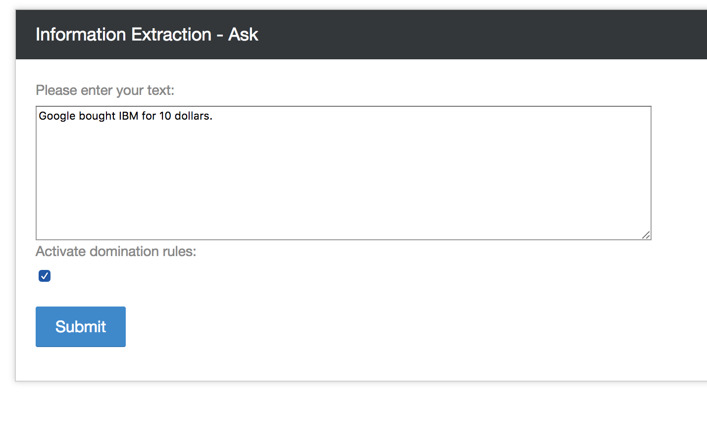

# Information Extraction

Source code of the post: http://philipperemy.github.io/information-extract/

Understanding articles, reports and generate a graph based (unsupervised learning).


<p align="center">
  
</p>

## Get Started (Linux/Mac OS)

```bash
git clone --recursive https://github.com/philipperemy/information-extraction.git

./init.sh

virtualenv -p python3.6 venv3.6
source venv3.6/bin/activate

pip install -r requirements.txt
python server.py
```

Also make sure that you can run the examples of both:
- https://github.com/philipperemy/Stanford-OpenIE-Python
- https://github.com/philipperemy/Stanford-NER-Python

Especially, make sure that GraphViz is installed beforehand. Try to run the dot command to see if this is the case. If not, run `sudo apt-get install graphviz` if you're running on Ubuntu (`brew install graphviz` on Mac OS).

From:

```
Google is expanding its pool of machine learning talent with the purchase of a startup that specializes in 'instant' smartphone image recognition.

On Wednesday, French firm Moodstocks announced on its website that it's being acquired by Google, stating that it expects the deal to be completed in the next few weeks. There's no word yet on how much Google is paying for the company.

Moodstocks' "on-device image recognition" software for smartphones will be phased out as it joins Google. Moodstocks' team will also move over to Google's R&D center in Paris, according to Google's French blog. 

"Ever since we started Moodstocks, our dream has been to give eyes to machines by turning cameras into smart sensors able to make sense of their surroundings," Moodstocks said in a statement on its site. "Our focus will be to build great image recognition tools within Google, but rest assured that current paying Moodstocks customers will be able to use it until the end of their subscription."
```

To (without dominating decision rules):

<p align="center">
  
</p>

And (with dominating decision rules):

<p align="center">
  
</p>


